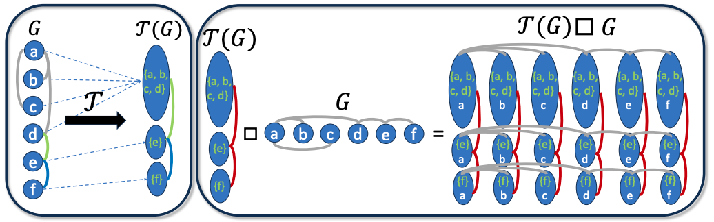

# A Flexible, Equivariant Framework for Subgraph GNNs via Graph Products and Graph Coarsening 

This repository contains the official code of the paper
**[A Flexible, Equivariant Framework for Subgraph GNNs via Graph Products and Graph Coarsening](https://arxiv.org/pdf/2406.09291) (NeurIPS 2024)**

<p align="center">
  
</p>

### More details coming soon!


## Credits

For academic citations, please use the following:

```
@article{bar2024flexible,
  title={A Flexible, Equivariant Framework for Subgraph GNNs via Graph Products and Graph Coarsening},
  author={Bar-Shalom, Guy and Eitan, Yam and Frasca, Fabrizio and Maron, Haggai},
  journal={arXiv preprint arXiv:2406.09291},
  year={2024}
}
```
